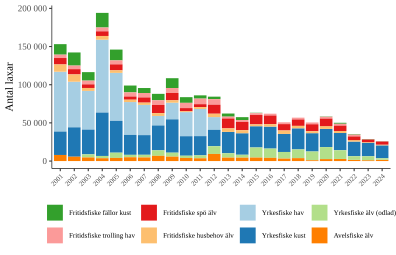

# Scripts to create various figures

## Folder `SweCatchDetailed`

Scripts to create a detailed bar chart of Swedish catches

## Folder `Figures`

Folder `Figures contains generated figures.`

## Folder `Data`

Folder `Data` contains raw data, scripts that format data to long format and the formatted data in long format.
